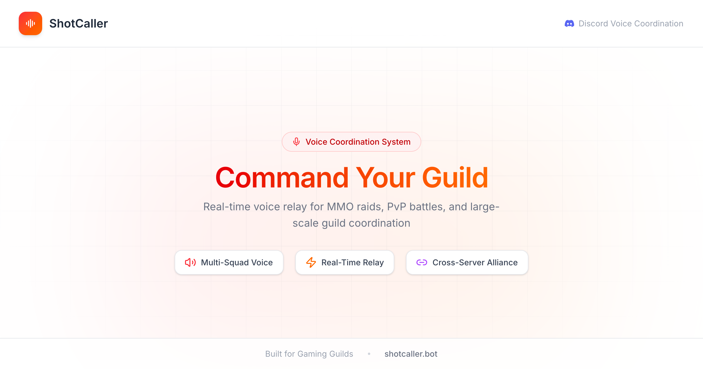

  

# ShotCaller

A Discord voice coordination platform for gaming guilds. One shot caller speaks, everyone hears — across all your squad channels.

## What It Does

ShotCaller deploys Discord bots that relay voice from a leader's channel to multiple squad channels in real-time. Perfect for guild wars, raids, and large-scale PvP where split-second coordination matters.

## Features

- **Voice Relay** — Leader speaks once, all squads hear instantly
- **Multi-Channel Support** — Up to 12 speaker bots across different voice channels
- **Cross-Server Alliances** — Relay voice across allied Discord servers
- **Team Management** — Invite managers with granular permissions
- **One-Click Setup** — Discord OAuth, no manual bot configuration

## Links

- [Website](https://shotcaller.bot)
- [Documentation](https://shotcaller.bot/docs)
- [Discord](https://discord.gg/JveJZRyW9b)
