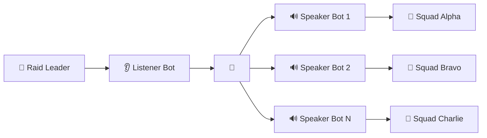

# 🎯 ShotCaller Bot

**Real-time voice coordination for gaming guilds and competitive teams**

*Coordinate multiple Discord voice channels simultaneously during large-scale battles*

## 🚀 What is ShotCaller?

ShotCaller is a **Discord voice coordination platform** designed specifically for gaming guilds and competitive teams engaged in large-scale multiplayer battles. It enables raid leaders and guild masters to broadcast tactical voice commands instantly across multiple Discord voice channels.

### 🎮 Perfect For:
- **MMO Guild Wars** - Throne and Liberty, Black Desert, World of Warcraft
- **Large-Scale PvP** - Coordinate 50+ players across multiple squads
- **Raid Leadership** - Synchronized callouts for complex mechanics
- **Territory Control** - Multi-front battle coordination
- **Competitive Gaming** - Professional esports team communication

## ⚡ How It Works

```mermaid
graph LR
    A[🎤 Raid Leader] --> B[👂 Listener Bot]
    B --> C[🔄]
    C --> D[🔊 Speaker Bot 1]
    C --> E[🔊 Speaker Bot 2] 
    C --> F[🔊 Speaker Bot N]
    D --> G[👥 Squad Alpha]
    E --> H[👥 Squad Bravo]
    F --> I[👥 Squad Charlie]
```

## 📊 Subscription Plans

| Plan | Speaker Bots | Price/Month | Best For |
|------|-------------|-------------|----------|
| **🔹 Squad Leader** | 4 speakers | $5.00 | Small teams (5-30 players) |
| **🔸 Raid Commander** | 8 speakers | $8.00 | Medium guilds (30-60 players) |
| **🔷 Guild Master** | 12 speakers | $15.00 | Large guilds (60-90 players) |
| **🔶 Alliance** | 24 speakers | $25.00 | Mega alliances (180+ players) |

*24/7 uptime, and priority support*

## 🚀 Join the Community

### 🎮 **For Gamers**
- **[Try ShotCaller Free](https://shotcaller.bot)** - 7-day free trial
- **[Join Discord](https://discord.gg/JveJZRyW9b)** - Community support & feedback
- **[ShotCaller Guide](https://shotcaller.bot/guide/shotcaller-discord-bot)** - Game-specific setup tutorials

**Built with ❤️ for the gaming community**

[Website](https://shotcaller.bot) • [Documentation](https://shotcaller.bot/docs) • [Discord](https://discord.gg/JveJZRyW9b) • [X](https://x.com/ShotcallerBot)

